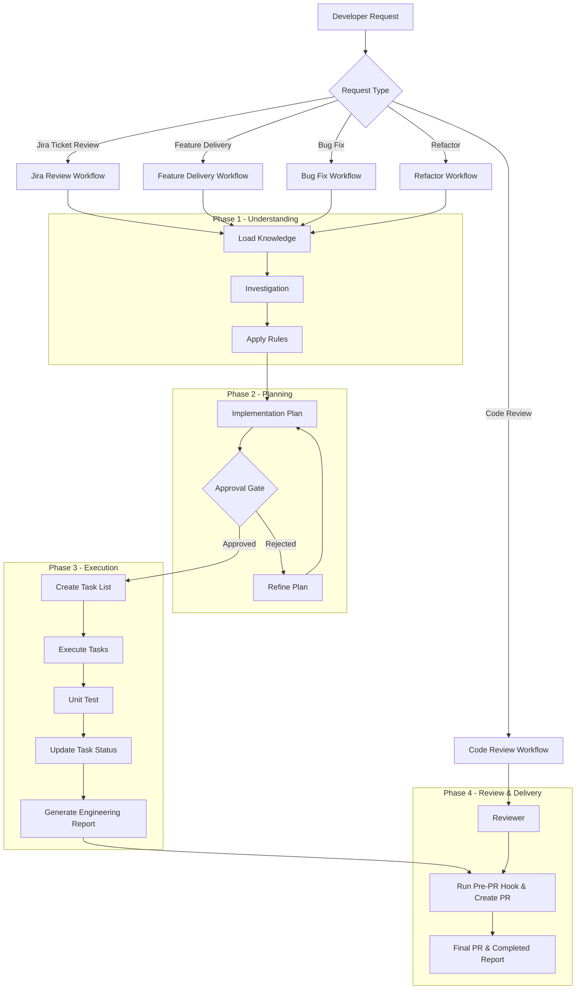

# Agentic Workspace Configuration: TOEIC App

This directory contains the workspace configuration, rules, agents, workflows, templates, and knowledge bases for autonomous AI agents collaborating on the TOEIC Practice project.

## 1. Tech Stack & Angular Architecture

We use the latest features in Angular 22+ to ensure high performance and modern code practices.
For full details on our stack, components, state management, and declarative data loading, please see:
[.agents/knowledge/frontend-architecture.md](file:///Users/nguyenson/Github/toeic/.agents/knowledge/frontend-architecture.md).

---

## 2. Context and Search Exclusions

- **Exclusion Rules**: Agents must strictly respect `.gitignore` and `.aiexclude` configurations.
- **Search Restrictions**: When running search tools (`grep_search`, `list_dir`) or terminal search commands, you must exclude ignored directories (such as `dist/`, `node_modules/`, `.git/`, and `.agents/`) to prevent processing compiled code or system logs, unless the user explicitly specifies an excluded directory path in their prompt.
- **Search Exclusions**: When executing any shell command to search or list files (e.g., `find`, `grep`, `ls`), you MUST explicitly add ignore/exclude parameters for directories like `dist/`, `node_modules/`, `.git/`, and `.agents/`.

---

## 3. Orchestration Workflow

You are operating inside an Enterprise Engineering System. You MUST NOT immediately start implementation. Always follow these sequential steps to route the request:

### Step 1 — Classify Request

Map the request type to a workflow:

- **Jira Ticket ID / Key** -> `jira-review` (Start here to retrieve and analyze ticket details before starting development)
- **New Feature** -> `feature-delivery`
- **Bug Fix** -> `bug-fix`
- **Refactor** -> `refactor`
- **Code Review** -> `code-review`

_If uncertain, ask clarifying questions instead of guessing._

### Step 2 — Load Workflow

Load the primary execution plan from:

```text
.agents/workflows/<workflow>.md
```

_Once the specific workflow is loaded, follow its internal instructions exclusively. The workflow will dictate which specific rules, knowledge base files, templates, and execution steps you need to execute for that request type._

---

## 4. Agent Orchestration Framework Overview


