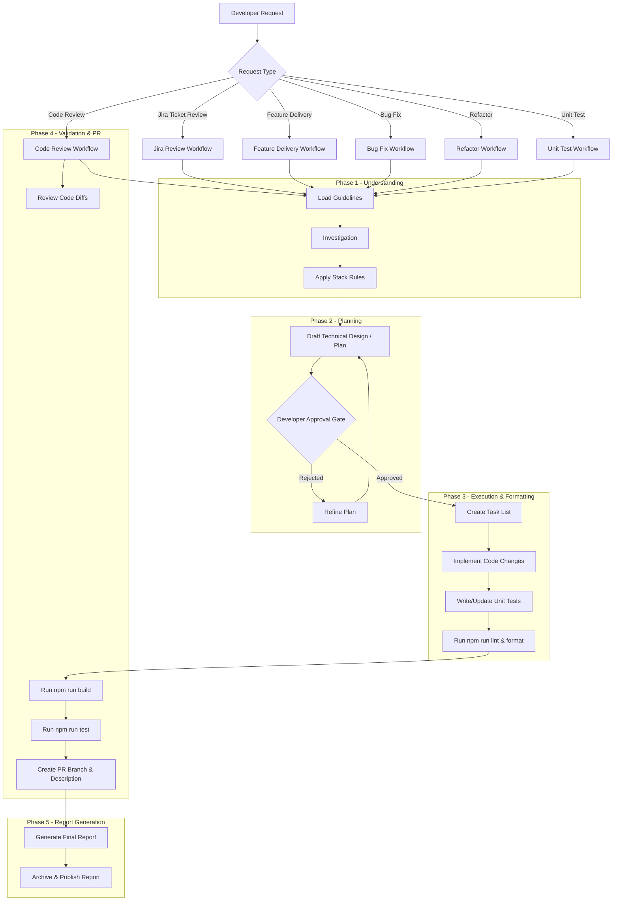

# Workspace Custom Instructions: Horizon 2 UI

---

**Priority — Read .github first**

When handling developer requests, Copilot must first read all files inside the `.github/` directory and choosing the right hooks that need to be made, strictly adhering to ## Automated Check Hook Reminders before making changes. Loading these files upfront ensures repository-wide rules, workflow mappings, and hooks are applied.

Copilot must load and apply that all of documents before implementing any code changes.

---

## Developer Workflow Orchestration 

This section is mandatory. Before making code changes, GitHub Copilot must follow these workflow phases in order and must not skip the planning/review step.

GitHub Copilot acts as a guide to assist the developer through these sequential phases when delivering changes:

---

## Automated Check Hook Reminders

- **Workflow Orchestration Hooks**: Execute phase hooks in order from `.github/hooks/`:

[Priority] Strictly apply all that is mentioned in these hooks before making any code changes. The hooks are:

    1. `.github/hooks/phase-1-understanding.hook.md`
    2. `.github/hooks/phase-2-planning.hook.md`
    3. `.github/hooks/phase-3-execution-formatting.hook.md`
    4. `.github/hooks/phase-4-validation-pr.hook.md`
    5. `.github/hooks/phase-5-report-generation.hook.md`
- **Hook Index**: See `.github/hooks/README.md` for mapping and execution guidance.

- **After Code Modifications**: Remind the developer to check formatting, linting, and generate reports via [.github/skills/post-code-change/SKILL.md](file:///d:/bitbucket/horizon2/horizon2-ui/ClientApp/.github/skills/post-code-change/SKILL.md).
- **Report Generation**: For all workflow types, follow [.github/skills/report-generation/SKILL.md](file:///d:/bitbucket/horizon2/horizon2-ui/ClientApp/.github/skills/report-generation/SKILL.md) to generate structured reports saved to `.github/reports/`.
- **Before Committing & Pushing**: Remind the developer to execute compilation tests, run unit tests, finalize reports, and prepare branch info via [.github/skills/pre-pull-request/SKILL.md](file:///d:/bitbucket/horizon2/horizon2-ui/ClientApp/.github/skills/pre-pull-request/SKILL.md).

---

## Strict Hook Mode (Always-On)

For every developer task, Copilot must:

1. Confirm strict mode is active.
2. Execute all 5 phase hooks in order without skipping any gate.
3. Provide a pre-implementation checklist mapped to each hook file.
4. Provide a final completion checklist mapped to each hook file.
5. Explicitly report planning gate outcome before implementation continues.
